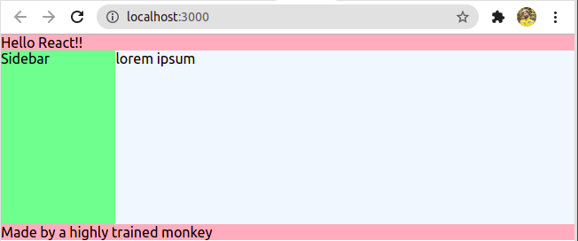

# Hello React

Node version 15 should work.

1. Create a new react app 
    - with the name "hello-react"
    - use create-react-app

2. Copy all the files _*except* the README and .git_ from your new project to this project

3. Start the app to check that the default project works

4. Edit the default app so that your main App file looks like this:

    ```jsx
    function App() {
        return (
            <div className="App">
                <Header />
                <Sidebar />
                <Body />
                <Footer />
            </div>
        );
    }
    ```

5. Implement the rest of the app (individual components and their CSS files) to create an app that looks something like this:



6. *BONUS!* Create a new component that simply contains one `<button>`. Then use that same component in the Header, the Sidebar, the Body and the Footer.